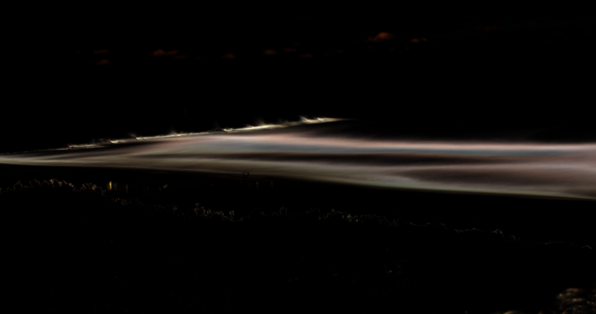
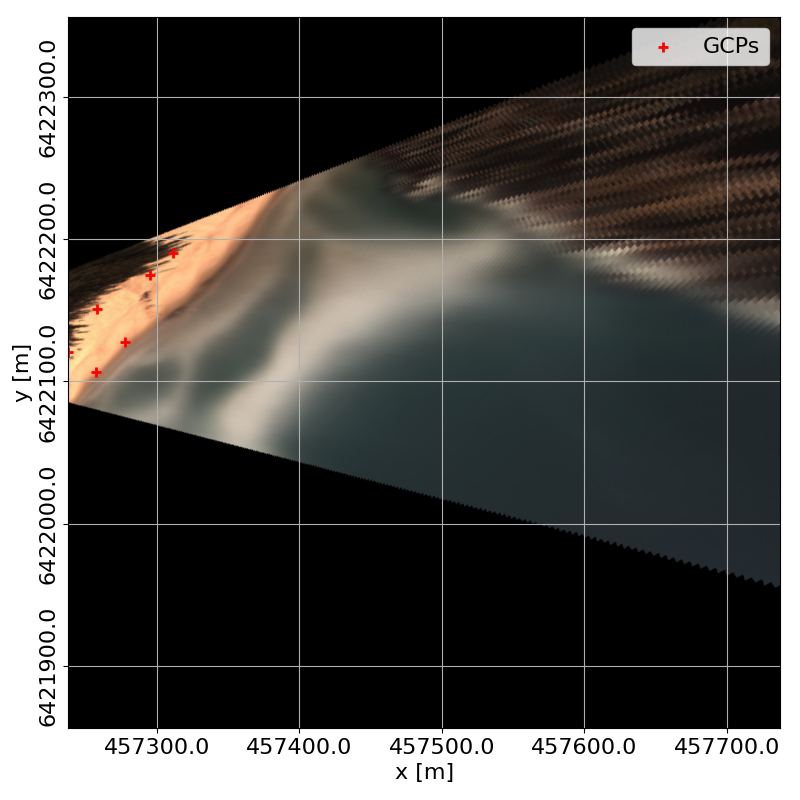

# Introduction

This project aims to provide the information needed to build an ARGUS-like
coastal monitoring system based on the Raspberry Pi computer board.

This is a new version of [picoastal](https://github.com/caiostringari/picoastal).

Main changes are:
 - Code now uses `picamera2`.
 - Support for FLIR cameras has been dropped in this version.

The image below was captured at Boomerang Beach (New South Wales) in early 2019
year with a very similar similar set-up to the one described in this repository.


# Table of Contents

[TOC]

# 1. Hardware

## 1.1. Computer Board


This project has been developed using a Raspberry Pi Model 5 B with 4Gb of memory.

The components of the system are:

- [Raspberry Pi board](https://www.raspberrypi.com/products/raspberry-pi-5/)
- [Raspberry Pi display case](https://www.canakit.com/raspberry-pi-4-lcd-display-case-pi4.html)
- [16Gb+ SD card](https://www.raspberrypi.org/documentation/installation/sd-cards.md)
- Keyboard
- Mouse
- External storage. In this case a 32Gb USB stick.
- [Optional] 4G modem for email notifications.
- [Optional] Battery bank
- [Optional] Solar panel

Assembly should be straight forward but if in doubt, follow the tutorials from
the Raspberry Pi Foundation.


## 1.2 Raspberry Pi High Quality Camera (2021 update)

In 2020, the Raspberry Pi foundation released the [High Quality Camera](https://www.raspberrypi.org/products/raspberry-pi-high-quality-camera/) for the Pi. This camera allows to use any type of lens which is perfect for our project. This camera costs around 75 USD and is much easier to use and program than other cameras. Everything is also open-source.

# 2. Software

## 2.1. Operating System (OS)

We will be using [Raspberry Pi OS](https://www.raspberrypi.org/software/) which usually comes pre-installed with the board.

Before doing anything, it is a good idea to update your system:

```bash
sudo apt update
sudo apt dist-upgrade
```

## 2.2 Camera Software

The code has been updated to use [`picamera2`](https://github.com/raspberrypi/picamera2). We need to first install it:

```bash
sudo apt install python3-picamera2 --no-install-recommends
```

Note that it's not recommended to install in an isolated environment using `pip`.

We will also need `ffmpeg`:

```
sudo apt install x264 ffmpeg
```

Install python libraries with `pip` system-wide.

```
sudo pip install natsort loguru --break-system-packages
```

# 2.3 Picoastal Code

To get the code do:

```bash
cd ~
git clone https://github.com/caiostringari/picoastal-picam2.git
```


# 3. Image Capture Configuration File


A configuration file is required to drive the camera. It tells the camera when to capture data, frame rates, etc. An example is:

```json
{
    "data": {
        "output": "/mnt/data/",
        "format": "jpeg",
        "hours": [5, 6, 7, 8, 9, 10, 11, 12, 13, 14, 15, 16, 17, 18]
    },
    "capture": {
        "duration": 20,
        "framerate": 10,
        "resolution": [1920, 1080],
        "quality": "MEDIUM"
    },
    "stream": {
        "duration": 20,
        "framerate": 30,
        "resolution": [640, 480]
    },
    "post_processing": {
        "extract_frames": true,
        "only_last_frame": false,
        "notify": false,
        "average": false,
        "deviation": false
    }
}
```

**JSON Options:**

Explanation of the configuration parameters above:

Streaming and Capturing:

- ```output```: The location to where to write the frames. Sub-folders will be created based on the hour of the capture cycle.
- ```framerate```: The capture frequency rate in frames per second.
- ```duration```: Capture cycle duration in seconds.
- ```resolution```: Image size for capturing or streaming.
- ```quality```: Image quality (bitrate). Options are `LOW`, `MEDIUM`, `HIGH`.
- ```hours```: Capture hours. If outside these hours, the camera does not grab any frames.

Post-processing:

- ```notify```: will send an e-mail (see below).
- ```average```: will create an average image.
- ```deviation```: will create the deviation image.


# 4. Capturing Frames


## 4.1. Displaying the Camera Stream

This is useful to point the camera in the right direction, to set the focus, and
aperture.

To launch the stream do:

```bash
cd ~/picoastal
python3 src/rpi/stream.py -i src/rpi/config_rpi.json > stream.log &
```

### Desktop icon (Optional)

It is also useful to create a desktop shortcut to this script so that you don't need to
use the terminal every time.

```bash
cd ~/Desktop
nano stream.desktop
```

```
[Desktop Entry]
Version=1.0
Type=Application
Terminal=true
Exec=python3 /home/pi/picoastal/src/rpi/stream.py -i /home/pi/picoastal/src/rpi/config_rpi.json
Name=PiCoastal Stream
Comment=PiCoastal Stream
Icon=/home/pi/picoastal/doc/camera.png
```

To save and exit use ```ctrl+o``` + ```ctrl+x```.


## 4.2. Single Capture Cycle

The main capture program is [capture.py](src/rpi/capture.py). To run a single capture cycle, do:

```bash
cd ~/picoastal/
python3 src/rpi/capture.py -i config_rpi.json.json > capture.log &
```

Similarly, it's useful to create a Desktop shortcut. For example:

```
[Desktop Entry]
Version=1.0
Type=Application
Terminal=true
Exec=python3 /home/pi/picoastal/src/rpi/capture.py -i /home/pi/picoastal/src/rpi/config_rpi.json.json
Name=PiCoastal Capture
Comment=PiCoastal Capture
Icon=/home/pi/picoastal/doc/camera.png
```

## 4.3. Scheduling Capture Cycles

The recommend way to schedule jobs is using ```cron```.

First we need to create a ```bash``` script that will call all the commands we
need need within a single capture cycle. One [example](src/rpi/cycle_rpi.json) would be:

```bash
#/bin/bash
# This is the main capture script controler

# create log dir
mkdir -p "/home/pi/logs/"  # Chage here as needed

# Define where your code is located
workdir="/home/pi/picoastal/src/"
echo "Current work dir is : "$workdir

# Get the current date
date=$(date)
datestr=$(date +'%Y%m%d_%H%M')
echo "Current date is : "$date

# Your configuration file
cfg="/home/pi/picoastal/src/rpi/config_rpi.json"
echo "Capture config file is : "$cfg

# Your email configuration
email="/home/pi/.gmail"
echo "Email config file is : "$email

# Change to current work directory
cd $workdir

# Current cycle log file
log="/home/pi/logs/picoastal_"$datestr".log"
echo "Log file is : "$log

# Call the capture script
script=capture.py
echo "Calling script : "$script
python3 $workdir/rpi/$script -cfg $cfg > $log 2>&1
echo $(<$log)

# Optional Post-processing

# statistical images
capdate=$(date +'%Y%m%d_%H%00')
python3 $workdir/post/average.py -i "/mnt/data/$capdate/" -o "average_$datestr.png"
python3 $workdir/post/variance.py -i "/mnt/data/$capdate/" -o "variance_$datestr.png"
python3 $workdir/post/brightest_and_darkest.py -i "/mnt/data/$capdate/" -b "brightest_$datestr.png" -d "darkest_$datestr.png"

# rectified images
python3 $workdir/post/rectify.py -i "average_$datestr.png" -o "average_rect_$datestr.tif" -gcps "xyzuv.csv" --camera_matrix "camera_matrix.json" --epsg "12345" --bbox "xmin,ymin,dx,dy"
python3 $workdir/post/rectify.py -i "variance_$datestr.png" -o "variance_$datestr.png" -gcps "xyzuv.csv" --camera_matrix "camera_matrix.json" --epsg "12345" --bbox "xmin,ymin,dx,dy"
python3 $workdir/post/rectify.py -i "brightest_$datestr.png" -o "brightest_rect_$datestr.tif" -gcps "xyzuv.csv" --camera_matrix "camera_matrix.json" --epsg "12345" --bbox "xmin,ymin,dx,dy"
python3 $workdir/post/rectify.py -i "brightest_$datestr.png" -o "brightest_rect_$datestr.png" -gcps "xyzuv.csv" --camera_matrix "camera_matrix.json" --epsg "12345" --bbox "xmin,ymin,dx,dy"

# timestack
python3 src/post/timestack.py -i "/mnt/data/$capdate/" -o "timestack_$datestr.nc" -gcps "xyzuv.csv" --camera_matrix "camera_matrix.json" --stackline "x1,y1,x2,y2"

# Call the notification
script=notify.py
attachment=$(tail -n 1 $log)
echo $attachment
echo "Calling script : "$script
python3 $workdir$script -cfg $email -log $log -a $attachment
```

To add a new job to cron, do:

```bash
crontab -e
```

If this is your first time using ```crontab```, you will be asked to chose a
text editor. I recommend using ```nano```. Add this line to the end of the file:

```
0 * * * * bash /home/pi/picoastal/src/cycle_rpi.sh
```

To save and exit use ```ctrl+o``` + ```ctrl+x```.

## 4.4. Controlling the System Remotely

The best way to control the camera is by using [Raspberrypi Connect](https://www.raspberrypi.com/software/connect/). It allows for both `SSH` and Remote Desktop access. 

# 5. Camera Calibration

Properly calibrating a camera is hard! To try to make it easier, the [`ChArUco`](https://docs.opencv.org/3.4/df/d4a/tutorial_charuco_detection.html) calibration model is recommended here. This method is advantageous over the traditional chessboard method because each marker on the calibration board can be tracked individually.

## 5.1. Generating a ChArUco Board

Each `ChArUco` board is unique. To create one with the default configuration, do:

```bash
python src/calibration/create_ChArUco_board.py
```

The result is is as follows:

<div align="center">

</div>


There are several parameters that can be set. Use `create_ChArUco_board.py --help` for details. Make sure to take note of which parameters were used to create the board because you will need to know then later!

## 5.2. Offline Calibration

To calibrate the camera from a series of images, do:

```bash
python src/calibration/calib_ChArUco_offline.py - i "input_images/" -o "camera_parameters.pkl|json"
```

Again, there are several parameters that can be set. Use `calib_ChArUco_offline.py --help` for details.


## 5.3. Online Calibration

**Note**: These scripts still need to be updated to use `picam2`.

To calibrate the camera on-the-fly, do:

To calibrate the Raspberry Pi camera on-the-fly, do:

```bash
python src/calibration/ChArUco_online_calibration_rpi.py - i "config.json" -o "camera_parameters.pkl|json"
```

As usual, there are several parameters that can be set. Use `ChArUco_online_calibration_flir|rpi.py --help` for details. The most import thing for camera calibration is to use the same board parameters as used for `create_ChArUco_board.py`

To investigate the results of a camera calibration do:

```bash
python src/calibration/show_calib_results.py -i "calibration.pkl" -o "result.png"
```

# 6. Post-processing

Post processing is usually too computationally expensive to run on the Raspberry Pi. However, some tools will be available here.

## 6.1. Average and variance Images

To compute an average ([or time exposure](http://www.coastalwiki.org/wiki/Argus_image_types_and_conventions)) image you need to install some extra packages:

```bash
sudo apt install python3-scipy
sudo python3 -m pip install scikit-image tqdm
```

To compute the average, we use  the [`average.py`](src/post/average.py) script. Using the sample data provided in `data/boomerang/`:

```bash
cd ~/picoastal/
python3 src/post/average.py -i "data/boomerang" -o "average.png"
```

To compute an variance image you need to install another extra packages:

```bash
sudo python3 -m pip install welford
```

This package allows us to use [Welford's](https://en.wikipedia.org/wiki/Algorithms_for_calculating_variance) method and save memory. To compute the variance, we use  the [`variance.py`](src/post/variance.py) script. Using the sample data provided in `data/boomerang/`:

```bash
cd ~/picoastal/
python3 src/post/variance.py -i "data/boomerang" -o "variance.png"
```
The results should look like this:

|       Average        |       Variance        |
| :------------------: | :-------------------: |
|  |  |


## 6.2. Brightest and darkest images

To find the brightest and darkest images, use the [`variance.py`](src/post/brightest_and_darkest.py) script:

```bash
cd ~/picoastal/
python3 src/post/brightest_and_darkest.py -i "data/boomerang" -b "brightest.png" -d "darkest.png"
```
The result should look like this:

|       Brightest        |       Darkest        |
| :--------------------: | :------------------: |
|  |  |

This scripts converts the images to the `HSV` colour space and looks for the images with summed highest and lowest brightness (i.e., the `V` in the `HSV`).

## 6.3. Rectification

**Warning:** I do not recommend running this program on the Raspberry pi. It's possible to do so, but everything will take forever and, unless you have a pi with 4Gb+ of RAM, you will run into memory issues very quickly.

First, we will need `GDAL` to support exporting files to `geotiff`. On Ubuntu do:

```bash
sudo add-apt-repository ppa:ubuntugis/ppa
sudo apt update
sudo apt install gdal-bin libgdal-dev python3-gdal
```

Example:

```bash
cd ~/picoastal/
python3 src/post/rectify.py -i "input.png" -o "rectified.tiff" -gcps "xyzuv.csv" --camera_matrix "camera_matrix.json" --epsg "12345" --bbox "xmin,ymin,dx,dy"
```

Applying this code to the four statistical images calculated above, we get:

|          Average          |          Variance          |
| :-----------------------: | :------------------------: |
|  |  |

|          Brightest          |          Darkest          |
| :-------------------------: | :-----------------------: |
|  |  |

To see all command line the options, do `python3 rectify.py --help`.

## 6.4. Timestacks

To extract  a timestack, do:

```bash
cd ~/picoastal/
python3 src/post/timestack.py -i "path/to/images" -o "timestack.pkl" -gcps "xyzuv.csv" --camera_matrix "camera_matrix.json" --stackline "457315.2,6422161.5,457599.4,6422063.6"
```

To see all command line the options, do `python3 timestack.py --help`.

The resulting stack (using `plot_timestack.py`) looks something like this:


It may not the he most beautiful timestack ever but our code can now provide all the main functionalities as the most powerful commercial options available.


# 7. Experimental Features

## 7.1. Optical Flow

A experimental script to compute surf zone currents based on [Farneback optical flow](https://docs.opencv.org/3.4/d4/dee/tutorial_optical_flow.html) is also available. This script will loop over all images and compute the `u` and `v` velocity components of the flow. The code will first rectify the images and then calculate the flow in the planar view so that the vectors are correctly oriented. This script is extremely slow and uses a lot of memory, hence not recommended to run on the Raspberry Pi. The output is a netCDF file, so you will need to install `xarray` with `pip install xarray netcdf4`. A mask in `geojson` format is required to mask regions of the image where it does not make sense to compute the flow.

Example:

```bash
cd ~/picoastal/
python3 src/exp/optical_flow.py -i "path/to/images" -o "flow.nc" -gcps "xyzuv.csv" --camera_matrix "camera_matrix.json" --bbox "xmin,ymin,dx,dy" --mask "mask.geojson"
```

Use ```python3 optical_flow.py --help``` to list all `CLI` options or call the script with no arguments to start the `GUI`. The results can be displayed with `plot_averaged_flow.py` and for the Boomerang dataset they look like this:


## 7.2. Machine Learning


Two machine learning models are provided here. The first model is a simple people detector. The second model is an active wave breaking segmentation model. Neither model can be run in real time on the Raspberry Pi without sacrificing too much FPS. Running these models in real-time resulted in less than 1 FPS which is unusable for coastal monitoring applications.

### 7.2.1. People Detector

This model is based on [Tensorflow's implementation](https://github.com/tensorflow/examples/tree/master/lite/examples/image_classification/raspberry_pi). To run the script, you will need to manually download one the latest versions of EfficientDetect models:

- [EfficientNet-Lite0](https://tfhub.dev/tensorflow/efficientdet/lite0/detection/1) | [EfficientNet-Lite1](https://tfhub.dev/tensorflow/efficientdet/lite1/detection/1) | [EfficientNet-Lite2](https://tfhub.dev/tensorflow/efficientdet/lite2/detection/1) | [EfficientNet-Lite3](https://tfhub.dev/tensorflow/efficientdet/lite3/detection/1) | [EfficientNet-Lite4](https://tfhub.dev/tensorflow/efficientdet/lite4/detection/2)


Make sure to install `tensorflow-lite` before running this scripts with `sudo python3 -m pip install --index-url https://google-coral.github.io/py-repo/ tflite_runtime`

These models can detect people with reasonable accuracy but do not expect great results out-of-the-box. In my experience, even the best model (`Lite4`) misses about 50% of the visible people in the image.

To run the script, do:

```bash
cd ~/picoastal/
python3 src/exp/offline_people_detector.py --model "lite-model_efficientdet_lite4_detection_default_2.tflite" --model_labels "coco_labels.txt" -i "path/to/images" -o "detections.csv" -threshold 0.3 --display --save_images "path/to/images_with_detections/"
```

Using data collected with a very early version of the system equipped the FLIR camera, the results look like this:


### 7.2.2. Active Wave Breaking Segmentation

This model aims to classify each pixel of the image in which waves that are actively breaking are happening. It was developed during my post-doc at France Energies Marines and is available from [deepwaves](https://github.com/caiostringari/deepwaves). It was trained with deep-water data so the performance with surf zone data is not expected to be very good.

```bash
cd ~/picoastal/ml
python3 src/exp/offline_wave_breaking_segmention.py --model "seg_xception.h5" -i "path/to/images/" -o "pixels.csv" --save-plots -roi 1250 350 400 150 -N 500 --plot-path "path/to/results"
```


## 8. Email Notifications (Optional)

**Warning**: This will require that you store a ```gmail``` user name and password in
plain text in your system. I strongly recommend to use an accounted that you
create exclusively for using the cameras.

After creating the account, create a hidden file named ".gmail" in your home
folder with the login and password.

```
cd ~
nano .gmail
```

Add the following contents:

```json
{
    "credentials": {
      "login": "some.login@gmail.com",
      "destination": "some.email@gmail.com",
      "password": "somepassword"
    },
    "options": {
      "send_log": true,
      "send_last_frame": true,
      "send_average": false,
      "send_deviation:": false
    }
}
```

To save and exit use ```ctrl+o``` + ```ctrl+x```.

Make sure to change gmail's security settings to allow you to send emails using python.

# 9. Known issues

...

# 10. Future improvements

I am open to suggestions. Keep in mind that I work in this project during my spare time and do no have access to much hardware, specially surveying gear.

# 11. Disclaimer

There is no warranty for the program, to the extent permitted by applicable law except when otherwise stated in writing the copyright holders and/or other parties provide the program “as is” without warranty of any kind, either expressed or implied, including, but not limited to, the implied warranties of merchantability and fitness for a particular purpose. the entire risk as to the quality and performance of the program is with you. should the program prove defective, you assume the cost of all necessary servicing, repair or correction.

