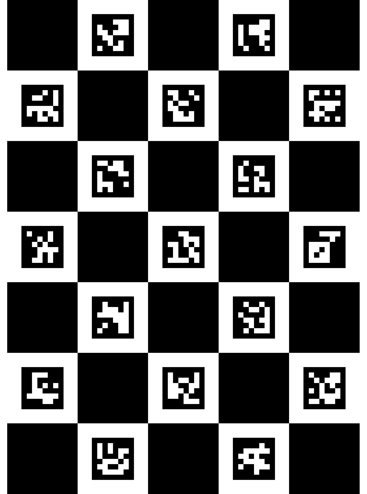

# Camera Calibration

Properly calibrating a camera is hard! To try to make it easier, the [`ChArUco`](https://docs.opencv.org/3.4/df/d4a/tutorial_charuco_detection.html) calibration model is recommended here. This method is advantageous over the traditional chessboard method because each marker on the calibration board can be tracked individually.

## Generating a ChArUco Board

Each `ChArUco` board is unique. To create one with the default configuration, do:

```bash
python src/calibration/create_ChArUco_board.py
```

The result is is as follows:

<div align="center">

</div>


There are several parameters that can be set. Use `create_ChArUco_board.py --help` for details. Make sure to take note of which parameters were used to create the board because you will need to know then later!

## Offline Calibration

To calibrate the camera from a series of images, do:

```bash
python src/calibration/calib_ChArUco_offline.py - i "input_images/" -o "camera_parameters.pkl|json"
```

Again, there are several parameters that can be set. Use `calib_ChArUco_offline.py --help` for details.


## Online Calibration

**Note**: These scripts still need to be updated to use `picam2`.

To calibrate the camera on-the-fly, do:

```bash
python src/calibration/ChArUco_online_calibration_rpi.py - i "config.json" -o "camera_parameters.pkl|json"
```

As usual, there are several parameters that can be set. Use `ChArUco_online_calibration_rpi.py --help` for details. The most import thing for camera calibration is to use the same board parameters as used for `create_ChArUco_board.py`

To investigate the results of a camera calibration do:

```bash
python src/calibration/show_calib_results.py -i "calibration.pkl" -o "result.png"
```