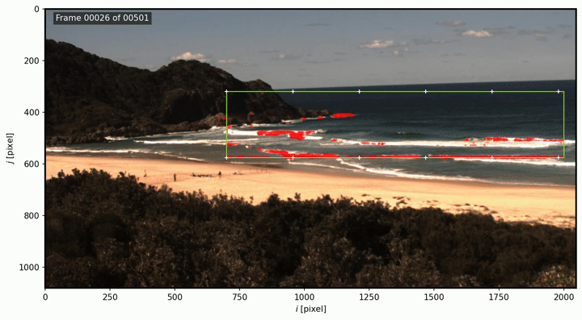

# Experimental Features

## Optical Flow

A experimental script to compute surf zone currents based on [Farneback optical flow](https://docs.opencv.org/3.4/d4/dee/tutorial_optical_flow.html) is also available. This script will loop over all images and compute the `u` and `v` velocity components of the flow. The code will first rectify the images and then calculate the flow in the planar view so that the vectors are correctly oriented. This script is extremely slow and uses a lot of memory, hence not recommended to run on the Raspberry Pi. The output is a netCDF file, so you will need to install `xarray` with `pip install xarray netcdf4`. A mask in `geojson` format is required to mask regions of the image where it does not make sense to compute the flow.

Example:

```bash
cd ~/picoastal/
python3 src/exp/optical_flow.py -i "path/to/images" -o "flow.nc" -gcps "xyzuv.csv" --camera_matrix "camera_matrix.json" --bbox "xmin,ymin,dx,dy" --mask "mask.geojson"
```

Use ```python3 optical_flow.py --help``` to list all `CLI` options or call the script with no arguments to start the `GUI`. The results can be displayed with `plot_averaged_flow.py` and for the Boomerang dataset they look like this:


## Machine Learning

Two machine learning models are provided here. The first model is a simple people detector. The second model is an active wave breaking segmentation model. Neither model can be run in real time on the Raspberry Pi without sacrificing too much FPS. Running these models in real-time resulted in less than 1 FPS which is unusable for coastal monitoring applications.

### People Detector

This model is based on [Tensorflow's implementation](https://github.com/tensorflow/examples/tree/master/lite/examples/image_classification/raspberry_pi). To run the script, you will need to manually download one the latest versions of EfficientDetect models:

- [EfficientNet-Lite0](https://tfhub.dev/tensorflow/efficientdet/lite0/detection/1) | [EfficientNet-Lite1](https://tfhub.dev/tensorflow/efficientdet/lite1/detection/1) | [EfficientNet-Lite2](https://tfhub.dev/tensorflow/efficientdet/lite2/detection/1) | [EfficientNet-Lite3](https://tfhub.dev/tensorflow/efficientdet/lite3/detection/1) | [EfficientNet-Lite4](https://tfhub.dev/tensorflow/efficientdet/lite4/detection/2)


Make sure to install `tensorflow-lite` before running this scripts with `sudo python3 -m pip install --index-url https://google-coral.github.io/py-repo/ tflite_runtime`

These models can detect people with reasonable accuracy but do not expect great results out-of-the-box. In my experience, even the best model (`Lite4`) misses about 50% of the visible people in the image.

To run the script, do:

```bash
cd ~/picoastal/
python3 src/exp/offline_people_detector.py --model "lite-model_efficientdet_lite4_detection_default_2.tflite" --model_labels "coco_labels.txt" -i "path/to/images" -o "detections.csv" -threshold 0.3 --display --save_images "path/to/images_with_detections/"
```

Using data collected with a very early version of the system, the results look like this:


### Active Wave Breaking Segmentation

This model aims to classify each pixel of the image in which waves that are actively breaking are happening. It was developed during my post-doc at France Energies Marines and is available from [deepwaves](https://github.com/caiostringari/deepwaves). It was trained with deep-water data so the performance with surf zone data is not expected to be very good.

```bash
cd ~/picoastal/ml
python3 src/exp/offline_wave_breaking_segmention.py --model "seg_xception.h5" -i "path/to/images/" -o "pixels.csv" --save-plots -roi 1250 350 400 150 -N 500 --plot-path "path/to/results"
```

