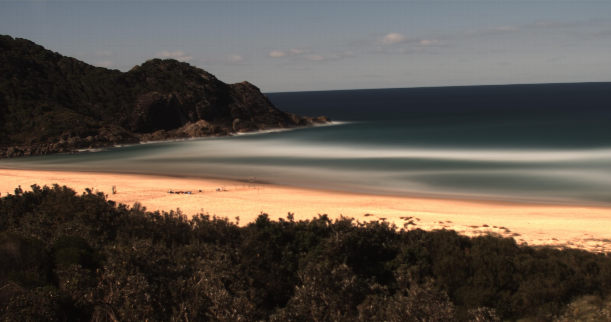
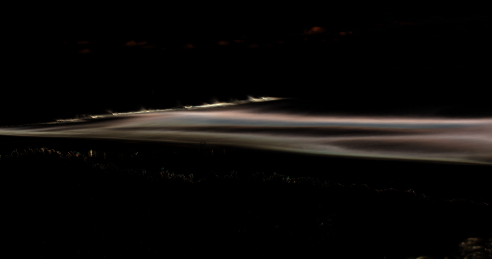
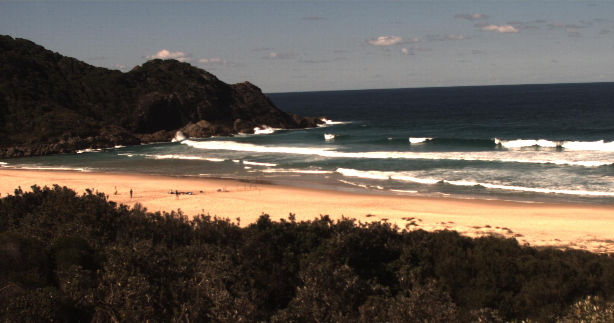
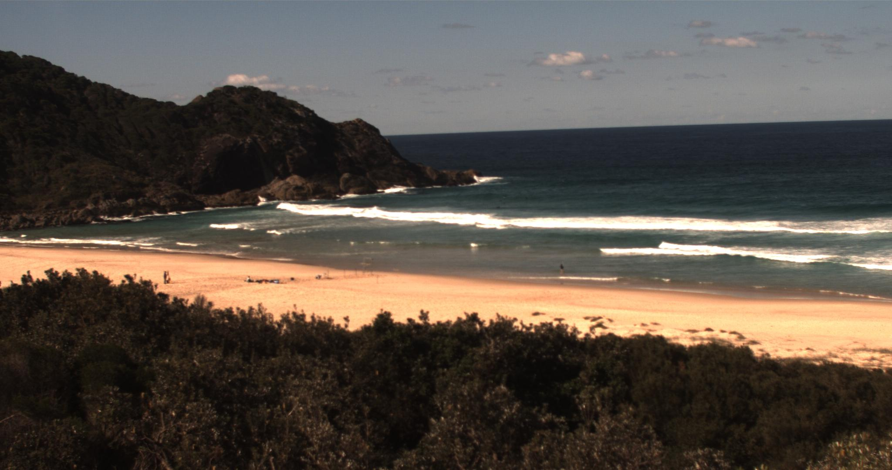
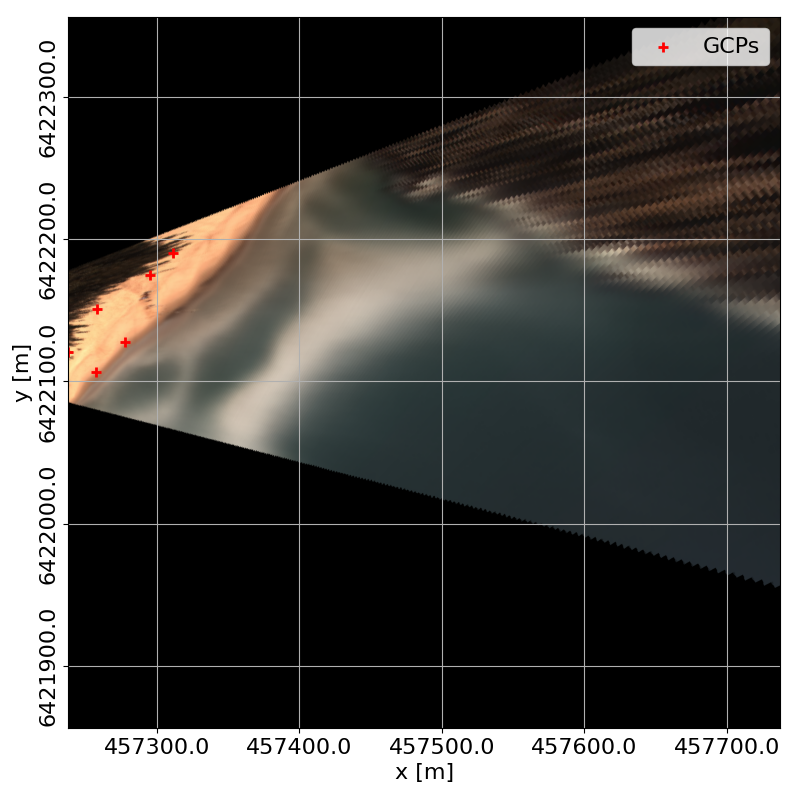
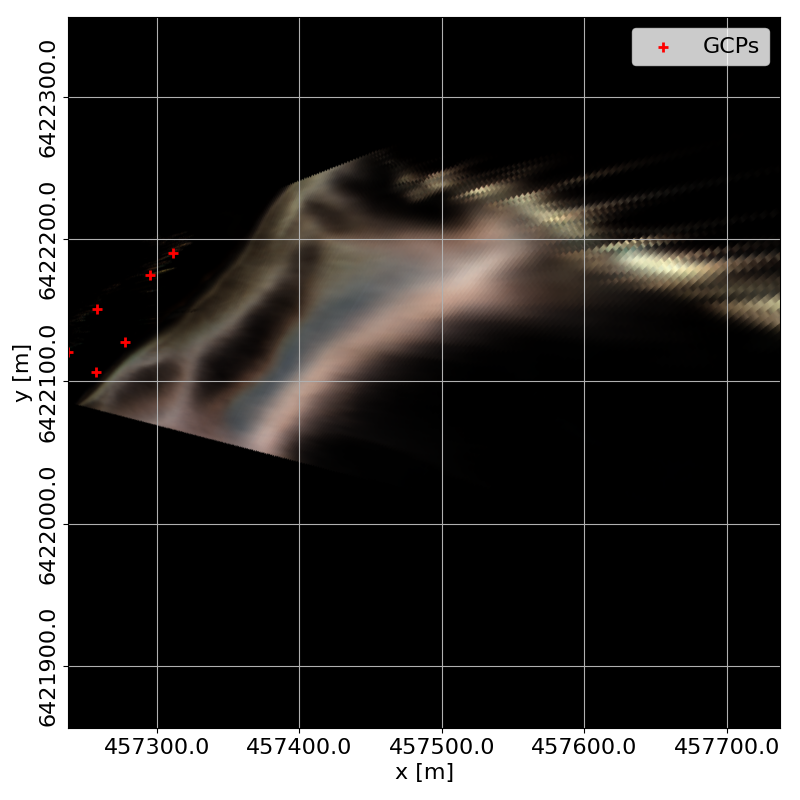
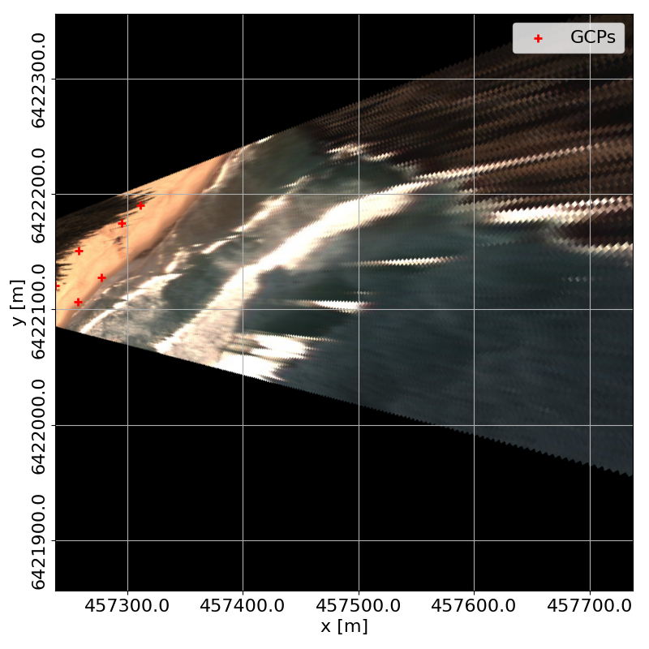
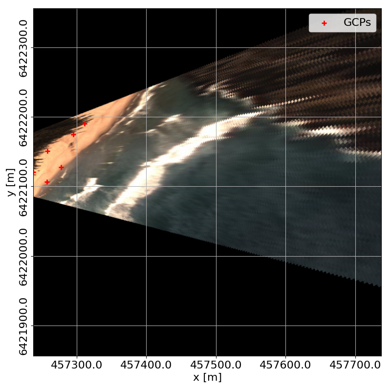
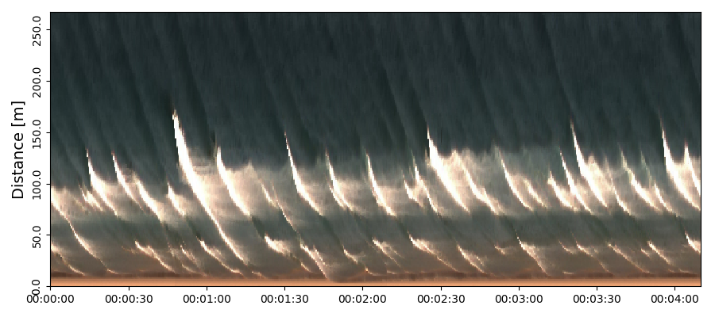

# Post-processing

Post processing is usually too computationally expensive to run on the Raspberry Pi. However, some tools will be available here.

## Average and variance Images

To compute an average ([or time exposure](http://www.coastalwiki.org/wiki/Argus_image_types_and_conventions)) image you need to install some extra packages:

```bash
sudo apt install python3-scipy
sudo python3 -m pip install scikit-image tqdm
```

To compute the average, we use  the [`average.py`](src/post/average.py) script. Using the sample data provided in `data/boomerang/`:

```bash
cd ~/picoastal/
python3 src/post/average.py -i "data/boomerang" -o "average.png"
```

To compute an variance image you need to install another extra packages:

```bash
sudo python3 -m pip install welford
```

This package allows us to use [Welford's](https://en.wikipedia.org/wiki/Algorithms_for_calculating_variance) method and save memory. To compute the variance, we use  the [`variance.py`](src/post/variance.py) script. Using the sample data provided in `data/boomerang/`:

```bash
cd ~/picoastal/
python3 src/post/variance.py -i "data/boomerang" -o "variance.png"
```
The results should look like this:

|       Average        |       Variance        |
| :------------------: | :-------------------: |
|  |  |


## Brightest and darkest images

To find the brightest and darkest images, use the [`variance.py`](src/post/brightest_and_darkest.py) script:

```bash
cd ~/picoastal/
python3 src/post/brightest_and_darkest.py -i "data/boomerang" -b "brightest.png" -d "darkest.png"
```
The result should look like this:

|       Brightest        |       Darkest        |
| :--------------------: | :------------------: |
|  |  |

This scripts converts the images to the `HSV` colour space and looks for the images with summed highest and lowest brightness (i.e., the `V` in the `HSV`).

## Rectification

**Warning:** I do not recommend running this program on the Raspberry pi. It's possible to do so, but everything will take forever and, unless you have a pi with 4Gb+ of RAM, you will run into memory issues very quickly.

First, we will need `GDAL` to support exporting files to `geotiff`. On Ubuntu do:

```bash
sudo add-apt-repository ppa:ubuntugis/ppa
sudo apt update
sudo apt install gdal-bin libgdal-dev python3-gdal
```

Example:

```bash
cd ~/picoastal/
python3 src/post/rectify.py -i "input.png" -o "rectified.tiff" -gcps "xyzuv.csv" --camera_matrix "camera_matrix.json" --epsg "12345" --bbox "xmin,ymin,dx,dy"
```

Applying this code to the four statistical images calculated above, we get:

|          Average          |          Variance          |
| :-----------------------: | :------------------------: |
|  |  |

|          Brightest          |          Darkest          |
| :-------------------------: | :-----------------------: |
|  |  |

To see all command line the options, do `python3 rectify.py --help`.

## Timestacks

To extract  a timestack, do:

```bash
cd ~/picoastal/
python3 src/post/timestack.py -i "path/to/images" -o "timestack.pkl" -gcps "xyzuv.csv" --camera_matrix "camera_matrix.json" --stackline "457315.2,6422161.5,457599.4,6422063.6"
```

To see all command line the options, do `python3 timestack.py --help`.

The resulting stack (using `plot_timestack.py`) looks something like this:



It may not the he most beautiful timestack ever but our code can now provide all the main functionalities as the most powerful commercial options available.